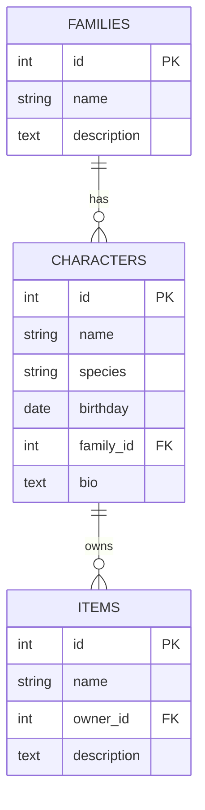

# Hello Kitty ERD

Simple Entity-Relationship Diagram (Mermaid)

Notes:
- `family_id` is nullable (characters may be unassociated).
- Deleting a family sets `family_id` to NULL for members.
- Deleting a character cascades to their items.
