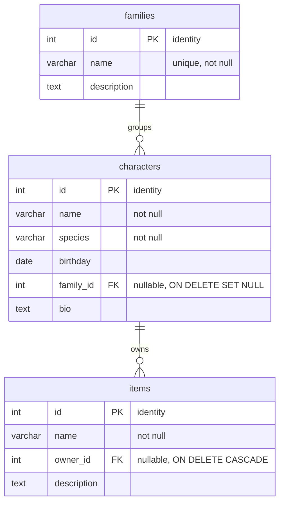

# Hello Kitty Universe — ERD

```mermaid
erDiagram
    families ||--o{ characters : "groups"
    characters ||--o{ items : "owns"

    families {
        int      id          PK "identity"
        varchar  name        "unique, not null"
        text     description
    }

    characters {
        int      id          PK "identity"
        varchar  name        "not null"
        varchar  species     "not null"
        date     birthday
        int      family_id   FK "nullable, ON DELETE SET NULL"
        text     bio
    }

    items {
        int      id          PK "identity"
        varchar  name        "not null"
        int      owner_id    FK "nullable, ON DELETE CASCADE"
        text     description
    }
```

## Relationships

| From | To | Cardinality | Meaning |
|------|-----|-------------|---------|
| `families` | `characters` | one-to-zero-or-many | A family has any number of characters. A character belongs to at most one family. |
| `characters` | `items` | one-to-zero-or-many | A character owns any number of items. An item belongs to exactly one character (or none). |

## Notes

- `characters.family_id` is **nullable** — a character may be unaffiliated.
  Deleting a family sets `family_id` to `NULL` on its characters
  (`ON DELETE SET NULL`).
- `items.owner_id` is nullable in the DDL, but the intended model is that
  every item belongs to a character. Deleting a character cascades and
  removes their items (`ON DELETE CASCADE`).
- `families.name` has a `UNIQUE` constraint.
- All `id` columns use `GENERATED ALWAYS AS IDENTITY` (Postgres 10+).

## See also

- [`../hello_kitty_universe_postgres.sql`](../hello_kitty_universe_postgres.sql) — the schema this ERD describes.
